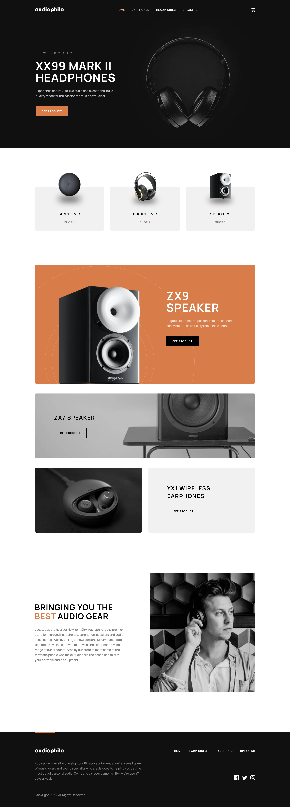

# Frontend Mentor - Audiophile e-commerce website solution

This is a solution to the [Audiophile e-commerce website challenge on Frontend Mentor](https://www.frontendmentor.io/challenges/audiophile-ecommerce-website-C8cuSd_wx). Frontend Mentor challenges help you improve your coding skills by building realistic projects. 

## Table of contents

- [Overview](#overview)
  - [The challenge](#the-challenge)
  - [Screenshot](#screenshot)
  - [Links](#links)
- [My process](#my-process)
  - [Built with](#built-with)
  - [What I learned](#what-i-learned)
  - [Continued development](#continued-development)
  - [Possible improvements](#possible-improvements)

## Overview

### The challenge

Users should be able to:

- View the optimal layout for the app depending on their device's screen size
- See hover states for all interactive elements on the page
- Add/Remove products from the cart
- Edit product quantities in the cart
- Fill in all fields in the checkout
- Receive form validations if fields are missed or incorrect during checkout
- See correct checkout totals depending on the products in the cart
  - Shipping always adds $50 to the order
  - VAT is calculated as 20% of the product total, excluding shipping
- See an order confirmation modal after checking out with an order summary
- Keep track of what's in the cart, even after refreshing the browser

### Screenshot

### Links

- Live Site URL: [live site](https://audiophile-ecommerce-el07.vercel.app/)

## My process

### Built with

- [TypeScript](https://www.typescriptlang.org/) - Programming language
- [Next.js](https://nextjs.org/) - React framework
- [TailwindCSS](https://tailwindcss.com/) - CSS library
- [Zod](https://zod.dev/) - Schema validation library

### What I learned

Next.js - The whole point of this project was to help me understand how to use Next.js. The most suprising to me were server side React components. It felt weird at first to create asynchronous React components. A common issue I ran into while building this application was hydration mismatch. I should be careful when defining and using the initial state value in a client component.  

### Continued development

Accessibility - While building web applications, I think alot about the most appropriate HTML tag for the data I have, structure of the application, tab order, etc. But I still feel the HTML I have written can be improved alot. I think a good approach to build accessible websites is to test them with screen readers, navigate using only the keyboard and try decreasing the network speed. I don't think I have done enough of anything mentioned.

### Possible improvements

- Use of CSS animations - I think adding well placed subtle animations make websites impressive. I haven't used animations alot. I realize their importance now. This website can benefit from using animations. I plan to add them at some places of the website in the future so that the transitions look smoother.

- Add unit and end-to-end tests - Tests are important. Every complex project should have many of them. But I thought test cases add a bit of friction for small projects that barely change and developed by just one developer. I realize I should add some test cases as it can help me make testing a habit and enable easy integration of a feature I wish to add to the current website in the future.
